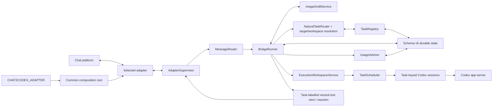

# Architecture

Chat2Codex separates platform transport from execution. Feishu/Lark and native
Weixin ClawBot are production adapters. `src/runtime/platform.ts` selects one,
while `src/runtime/bridge-runtime.ts` is the common composition root for
`CodexRunner`, `MessageRouter`, state, `AdapterSupervisor`, and `ChatSender`.
Adding an adapter implements the contract under `src/adapters`; it does not
construct or change Router/Runner business logic.

The boundaries are intentionally small:

| Layer | Owns | Must not own |
| --- | --- | --- |
| Composition root | Runner, Router, state, Supervisor, neutral ChatSender wiring | platform protocol parsing or rendering |
| Adapter | SDK/HTTP calls, wire events, platform IDs, card/text rendering | Codex queues, recovery, business commands, core construction |
| AdapterSupervisor | lifecycle, health, strict `adapterId` routing | platform payload parsing, Codex behavior |
| MessageRouter | normalized ingress dispatch | SDK construction, execution state |
| BridgeRunner | access control, durable work, approvals, Codex lifecycle | platform SDKs and wire payloads |
| Task orchestration | bounded natural decisions, deterministic target/workspace resolution, task lifecycle | platform payloads or SDK calls |
| Execution workspace / scheduler | worktree or output isolation, task FIFO, canonical-root FIFO, global capacity | automatic merges or unsafe optimistic writes |
| State store | schema-v5 envelope, task/job/outbox/advisor identity, isolated adapter partitions | adapter-specific objects or runtime permission grants |
| UsageAdvisor | closed enum signals, bounded redacted aggregates, code-owned proposal templates, review status | prompts, sender/task/path data, execution, deployment, configuration, or permission changes |

## Adapter contract

A `ChatAdapter` supplies a stable descriptor, capability flags, lifecycle,
view send/update operations, message reactions, and attachment streams. It
emits only normalized message, action, and diagnostic events. Interactive
decisions are validated by an injected `InteractionPolicy` against the exact
view disclosed by that adapter.

For ordinary runs, the core requests a processing reaction on the source
message, emits throttled text progress, and removes the reaction at terminal
state. Interactive-capable adapters use views; text-only adapters use
sender-bound reply codes for approval and structured decisions. The adapter
alone maps neutral operations to platform calls.

| Capability | Feishu/Lark | Weixin |
| --- | --- | --- |
| Markdown / rich post | yes | no, rendered as text |
| Interactive/updateable views | yes | no |
| Inbound attachments | image, file | file, plus durable one-to-four-image-before-text drafts via encrypted CDN |
| Outbound results | rich text | ordered text, explicitly declared image/file messages via encrypted CDN |
| Processing signal | message reaction | typing indicator |
| Conversation scope | direct and allowlisted groups | direct only |

The Weixin adapter uses `weixin:<ilink_bot_id>` as its stable adapter id. It
commits `getupdates` cursors only after the complete batch reaches the core, so
a failed batch replays through the core message-id deduplicator. Its private
runtime file retains the cursor, latest per-user `context_token`, typing ticket,
and short-lived attachment descriptors. Outbox idempotency keys become iLink
`client_id` values. Groups, voice/video, and in-place updates remain unsupported.

## Phase 1 task and concurrency model

Weixin natural routing holds a short conversation-level acceptance section only
while it validates access, classifies intent, resolves ambiguity, and persists
task/job ownership. A durable run then moves to `TaskScheduler`; a second message
in the same conversation can create or control another task without waiting for
the first Codex turn. Every task owns its session epoch, optional Codex thread,
execution directory, interactions, retry state, and labelled delivery. One Codex
thread has one task owner, and one task has at most one active turn.

The scheduler combines three independent constraints: a FIFO per task, a FIFO
per canonical root only for `canonical_fifo`, and a global semaphore. Git roots
receive persistent worktrees under `<CHAT2CODEX_HOME>/worktrees/<taskId>`. A
non-Git `output_only` request receives `<workspace>/outputs/tasks/<taskId>` only
after an installed-Codex negative write probe succeeds for the detected Codex
version. Probe failure, general non-Git mutation, or uncertain intent uses the
canonical root and serializes safely. No automatic merge or snapshot merge is
performed.

Image-only Weixin messages are validated and staged by conversation plus sender.
The first four remain durable until text attaches them to one task, explicitly
discards them, clarification resolves, or TTL cleanup deletes them. A fifth image
does not consume the earlier four. Durable clarification stores only bounded task
IDs and the draft key, never image bytes or descriptors.

Schema v5 preserves the task/conversation registries and task-qualified execution
while adding ordered text/image/file deliveries, immutable staging metadata,
stable delivery identities, and the optional UsageAdvisor partition. A v3/v4
envelope is backed up before
migration; one previous chat/thread becomes one imported compatibility task.
Queued jobs recover against their exact task, running jobs become interrupted,
and orphan or future-schema references fail closed.

The output parser accepts one exact final `CHAT2CODEX_OUTPUT_FILES` line from
the untruncated Codex result. No diff, path mention, input file, log, or changed
file can enter the outbound pipeline implicitly. `DeliverableStager` validates
the exact task roots and copies immutable snapshots under
`<CHAT2CODEX_HOME>/outbound/<taskId>/<jobId>`. In one state mutation,
`MediaOutbox` records visible text chunks first and declared images/files next.
The adapter acknowledges each entry separately; a failure stops the group, and
recovery resumes the lowest undelivered sequence without rerunning Codex. Recent
complete media groups retain their backing job and staging directory for the
configured time window before count-based pruning may delete the whole group.

## UsageAdvisor boundary

UsageAdvisor accepts only `task_target_clarification`,
`abandoned_image_draft`, `routing_correction`, `delivery_retry`,
`ownership_conflict`, and `recovery_action`. The retention contract is proposal threshold: 3,
aggregate cap: 6, proposal cap: 6, and recent timestamp cap: 8.
Only enum code and timestamp enter the advisor; chat text, sender, task, prompt,
path, and credential data do not. Proposal sections are fixed code templates for
observation, evidence, benefit, risks, scope, rollback, and verification.

Bridge friction recording is best-effort and happens after the original
clarification or durable retry transition. Persistence and notification failures
are logged but cannot block that original state machine. `/advisor` lists at most
six proposals. `/advisor approve <proposal-id>` records
`approve_for_planning`; `/advisor reject <proposal-id>` is terminal. Approval
never applies, executes, or deploys a change and never edits configuration or
permissions. The core intentionally exposes no apply interface or external I/O.
The advisor partition is optional in schema v5, so an older package ignores it
during rollback; reloading a legacy state yields an empty advisor.

Ordered outbound Weixin media and the review-only UsageAdvisor foundation coexist
in schema v5.

## Phase 3 authenticated Desktop boundary

Schema v6 adds root-thread bindings, generation ownership, actual-turn fences,
excluded control turns, advisory wakes, release requests, and reconciled/mirrored
high water without weakening Phase 2 media or UsageAdvisor. One in-process Gateway
shares the single serialized state writer with BridgeRunner and binds only IPv4
127.0.0.1. Distinct prompt_hook, stop_hook, and desktop_mcp token files authorize
closed endpoint sets; request and response HMACs are fresh, replay-resistant, and
contain no raw prompt, sender, path, token, or result bytes.

UserPromptSubmit is the start gate: a current Desktop owner/generation creates one
durable fence on its actual turn_id before a model turn may continue. Stop never
blocks or supplies result content; it is a best-effort wake. Recovery scans stable
thread/read(includeTurns: true), stages declared files immutably, and atomically
commits deterministic outbox identities plus high water. Missing/malformed reads
advance nothing and mark ownership uncertain. An explicit concrete root threadId
is required; unbound roots and child Agent threadIds remain non-exportable even
when a parent session identity is shared.

The Gateway has no dependency on plugin/list. The repository ships only inert,
disabled examples and a Hook SHA-256 manifest. Installation and schema v6 to v5
rollback are separately approved operational actions; any binding, fence, wake,
release, staging, uncertain state, or undelivered outbox obligation blocks a full
downgrade. The preferred rollback is immediate bridge-only mode in schema v6.

Run `bun run typecheck:contracts` to compile the reference adapter and
`bun test tests/architecture-boundaries.test.ts` to verify the isolation rule.

Adapters currently run in the Chat2Codex process. A future external gateway
can move platform credentials and SDKs into another process without changing
the core contracts. Process-level isolation is not part of the current architecture.
