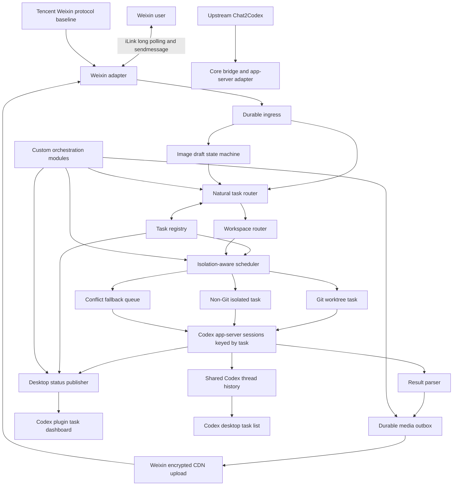

# Weixin-to-Codex Orchestrator Design

Date: 2026-08-01
Status: Proposed for user review
Base: Chat2Codex v0.8.0 fork

## 1. Objective

Extend the existing Chat2Codex fork into a durable Weixin-to-Codex orchestrator that provides all of the following:

1. Connect a personal Weixin ClawBot to local Codex without exposing a public webhook.
2. Accept ordinary human language for creating, continuing, steering, stopping, inspecting, and approving multiple Codex tasks.
3. Support inbound and outbound text-plus-image workflows despite Weixin transporting text and media as separate native messages.
4. Run independent tasks concurrently when isolation is safe, while preventing conflicting writes.
5. Make Weixin-created Codex threads visible in the Codex desktop app and provide an authoritative real-time task dashboard there.
6. Keep the custom system maintainable as upstream Chat2Codex, Codex app-server, and Tencent's Weixin protocol implementation evolve.

The bridge, scheduler, state, and files remain local. The machine makes outbound HTTPS connections to Weixin/iLink, Weixin CDN, and the configured Codex model service. It does not require a public IP, domain, inbound port, or public webhook.

## 2. Confirmed Product Decisions

### 2.1 Workspaces

New tasks are routed to one of six fixed business workspaces unless the user explicitly names another existing project or path:

| Intent | Workspace |
| --- | --- |
| Code and professional work | `F:/workspace/workbuddy/Work` |
| Travel | `F:/workspace/workbuddy/Travel` |
| Personal matters | `F:/workspace/workbuddy/Personal` |
| Finance and investing | `F:/workspace/workbuddy/Finance` |
| AI tools and agent work | `F:/workspace/workbuddy/AI-Lab` |
| Course learning | `F:/workspace/workbuddy/Learning` |

`F:/workspace/workbuddy/Claw` remains a legacy course project. It is not a default route and is used only when the user refers to that project or an existing task already bound to it.

### 2.2 Natural conversation

The user does not need fixed phrases or slash commands. The bridge must infer intent from ordinary conversation and current task state. Slash commands remain as compatibility and recovery controls, not the primary interface.

### 2.3 Multi-task execution

One Weixin direct-message conversation may own multiple active and historical tasks. A task, rather than the Weixin chat, is the unit of Codex thread ownership, approvals, progress, cancellation, output, and recovery.

### 2.4 Images

Inbound image bundles contain at most four images. Images are sent before their instruction text. Images alone never start Codex work.

### 2.5 Outbound media

Codex explicitly declares intentional deliverable files. The bridge sends visible text, images, and file attachments as an ordered sequence of separate native Weixin messages.

## 3. Target Architecture

## 4. Task Registry

Replace the current one-session-per-chat model with a durable registry keyed by `taskId`. Each task records:

- stable `taskId`;
- short display title and normalized aliases;
- source adapter, conversation, and authorized sender identity;
- canonical workspace and isolation workspace;
- Codex `threadId`, active `turnId`, and session epoch;
- status and last progress summary;
- timestamps and recency score;
- current user objective and a bounded recent-request summary;
- pending approval, permission, user-input, and MCP request identifiers;
- inbound image draft association;
- durable job and outbound delivery identifiers.

Task states are explicit: `draft`, `queued`, `waiting_workspace`, `running`, `waiting_approval`, `waiting_input`, `stopping`, `completed`, `failed`, `interrupted`, and `archived`.

Every Weixin progress, clarification, approval, and terminal message begins with a compact task label such as `[日本酒店]`. This prevents concurrent tasks from becoming indistinguishable in a single chat.

## 5. Natural Task Routing

### 5.1 Structured decision

The model-based router receives the incoming text plus a bounded list of candidate tasks. It returns validated structured data, not a rewritten command string:

- action: create, continue, steer, stop, inspect, retry, archive, resume, fork, compact, approve, deny, grant-turn, grant-session, answer, or service/task-management operation;
- target task IDs;
- new-task workspace intent when applicable;
- whether the pending image bundle is used or discarded;
- confidence and one short clarification question when needed.

The action registry covers the complete existing Chat2Codex command surface. Slash-command parsing and natural-language routing both resolve to the same internal command AST so behavior and authorization do not diverge.

### 5.2 Target resolution

Candidate scoring uses, in order:

1. explicit task title, alias, thread, project, or workspace reference;
2. a uniquely matching pending approval/input request;
3. semantic similarity to the task objective and recent requests;
4. conversation references and quoted task-labelled messages;
5. recency, but only as a tie-breaker.

Creating a task never silently reuses an unrelated thread. Continuing, steering, stopping, granting permission, or sending files never acts on multiple plausible targets without clarification.

Generic replies such as "同意" may resolve automatically only when exactly one authorized pending decision exists. Generic consent may choose a one-turn acceptance when offered, but it never grants session-wide permission. Session permission requires explicit session-scope wording.

Quoted text is context only. It cannot itself approve, stop, redirect, or grant permission.

### 5.3 Failure behavior

Classifier timeout, malformed output, low confidence, missing task, or ambiguous high-risk action fails closed to one concise clarification. The raw user message is not persisted in approval state and is not replayed onto a different task after restart.

## 6. Workspace Routing and Safe Concurrency

### 6.1 Routing

Existing tasks always retain their recorded workspace. New tasks use an explicit path/project when supplied; otherwise the semantic workspace router selects one of the six fixed workspaces. Multiple plausible workspaces cause clarification. All paths are canonicalized before authorization and scheduling.

### 6.2 Concurrency policy

Different canonical workspaces may run concurrently, bounded by a configurable global limit. The initial production default is four active tasks and eight reusable app-server sessions.

Tasks in the same logical workspace use the safest available backend:

1. **Git repository:** create a per-task Codex worktree. Independent tasks run concurrently and merge only through normal Git operations.
2. **Non-Git output-only task:** assign a private task directory under `outputs/tasks/<taskId>` and restrict writes to that directory. These tasks run concurrently.
3. **Non-Git general mutation:** use a task snapshot/staging directory. At publish time, compare each destination with its recorded base hash. Apply non-conflicting changes atomically; preserve conflicting results and ask the user to resolve them.
4. **Cannot isolate safely:** acquire the canonical-workspace FIFO lock and run serially.

One Codex thread still permits only one active turn. A task waiting for an approval or user input retains its task identity but does not permit another turn on that thread.

The scheduler never infers that shell commands are conflict-free merely because prompts mention different files. Isolation or a validated write set is required.

## 7. Inbound Text and Images

### 7.1 State machine

An image-only message creates or extends a durable draft keyed by conversation and sender. The bridge downloads and validates the image, records its hash, acknowledges the current count, and does not start Codex.

The draft accepts at most four supported images. A fifth image is rejected without deleting the first four. Duplicate message IDs are idempotent. Unsupported media, bad signatures, oversized files, failed decryption, and expired attachment descriptors produce task-independent diagnostic replies.

### 7.2 Text following images

When text arrives with a pending draft, the natural router must choose one of three outcomes:

1. attach the images to a new or existing target task and submit one Codex turn;
2. explicitly discard the images and execute the text as another task;
3. ask whether the text belongs with the images.

Wording such as "放弃前面的图片，做另一个任务" discards and securely deletes the draft before routing the new task. Ambiguous text does not consume or submit the images.

### 7.3 Expiry and restart

The default draft TTL is 30 minutes. Expiry securely removes staged files and sends one bounded notice when the user next interacts or when scheduled cleanup can deliver it. Drafts survive graceful restart, are revalidated by path, signature, hash, size, sender, and root, and are never processed without text.

## 8. Outbound Text, Images, and Files

### 8.1 Deliverable declaration

The Codex turn prompt defines one optional final control line:

`CHAT2CODEX_OUTPUT_FILES: ["absolute-path-1", "absolute-path-2"]`

Only files intentionally declared on that line are considered for outbound delivery. The runner parses the control line from the full final agent message before chat-text truncation, removes it from visible text, and returns structured `outputFiles`. Changed files, mentioned paths, read inputs, logs, and attachments are never inferred as deliverables.

### 8.2 Validation and staging

Before durable delivery, each declared path must be absolute, canonical, a regular non-symlink file, within the task's authorized workspace or artifact root, and within configured count and byte quotas. The bridge detects media type from content, snapshots the file into a private per-delivery staging directory, and records size and SHA-256. This prevents later workspace edits from changing what is sent on retry.

### 8.3 Durable ordered outbox

Extend the outbox from text-only messages to ordered `text`, `image`, and `file` entries. Each entry has a stable delivery ID, sequence, task ID, staged-file metadata, attempts, and terminal status.

The default order is visible final text followed by declared files in declaration order. Every element is a separate native Weixin message because the bot transport cannot combine arbitrary text and images into one native message. A retry resumes from the first undelivered element and never reruns Codex.

### 8.4 Weixin media protocol

For each image or file:

1. calculate plaintext size and MD5;
2. generate an AES-128 key and encrypted size;
3. call `getuploadurl`;
4. encrypt with AES-128-ECB and upload to the returned Weixin CDN location;
5. send an IMAGE or FILE `MessageItem` using `sendmessage`;
6. use the durable delivery ID as the stable `client_id`.

Secrets, AES keys, signed upload URLs, and full media descriptors are redacted from logs.

## 9. Codex Desktop Visibility

### 9.1 Native thread history

Keep Chat2Codex bridge state and Weixin credentials under `CHAT2CODEX_HOME`, but run Codex with the user's primary `CODEX_HOME` so its stored threads are discoverable by the desktop app. Use a dedicated Chat2Codex profile and explicit config overrides to disable unrelated global MCP servers for bridge-launched app-server processes. This avoids the prior startup-timeout failure while sharing thread history and authentication.

New thread titles use `[微信] <task title>`. The bridge never edits Codex SQLite databases or session JSON directly; it uses app-server APIs and normal Codex persistence only.

### 9.2 Real-time status

On Windows, the Codex desktop and Chat2Codex still use separate app-server processes because managed daemon lifecycle is Unix-only. Native desktop `active` state is therefore not authoritative for a Weixin turn.

Add a loopback-only status publisher backed by the task registry. It exposes an authenticated snapshot and event stream containing task metadata and state transitions but no secrets or full prompts. A personal Codex plugin provides tools and an app dashboard that shows queued, running, waiting, approval, progress, completed, failed, and interrupted states in real time. Selecting a dashboard task opens or identifies its shared Codex thread.

The dashboard is authoritative for live state; the native sidebar is authoritative for persistent thread history. Acceptance does not require the native sidebar to show a false `active` badge.

## 10. Process and Security Boundaries

- The Weixin adapter remains direct-message only unless group support is separately designed.
- Only allowlisted senders can route tasks or decisions.
- All approvals are bound to adapter, conversation, sender, task, thread, turn, request, expiry, and the exact decision set supplied by Codex.
- Bridge state has one writer and atomic durable persistence.
- The desktop status endpoint listens on loopback only and requires a local capability token stored outside logs and prompts.
- No public webhook, public listener, or unauthenticated non-loopback app-server endpoint is introduced.
- Credentials stay in the private Weixin credential store; they are never copied into task state, memory, deliverables, or the plugin UI.
- Restart never automatically replays a task that reached `running`; it reports `interrupted` because prior side effects cannot be inferred safely.

## 11. Upstream and Ownership Strategy

Continue from Chat2Codex rather than reimplementing transport, approvals, recovery, and Codex JSON-RPC from scratch. The repository layout and Git workflow become:

- personal fork `origin`;
- official `hzhaoy/chat2codex` as `upstream`;
- untouched upstream tags and `upstream/main`;
- custom orchestration modules with narrow integration points;
- an integration branch for each upstream upgrade;
- pinned Tencent `openclaw-weixin` protocol baseline and preserved MIT notice.

Custom modules are:

- `TaskRegistry`;
- `NaturalTaskRouter`;
- `WorkspaceRouter`;
- `IsolationScheduler`;
- `ImageDraftService`;
- `MediaOutbox`;
- `DesktopStatusPublisher`;
- Codex desktop plugin/dashboard.

The existing `BridgeRunner` must delegate to these modules rather than accumulating another monolithic block of conditions. Platform wire details remain in the Weixin adapter; scheduler and task semantics remain platform-neutral.

Each upstream upgrade records a compatibility matrix containing Chat2Codex revision, Codex CLI/app-server schema version, and Tencent protocol baseline. The upgrade flow is: fetch, integrate on a temporary branch, regenerate protocol schemas, inspect diffs, run all checks, run local app-server smoke tests, run Weixin contract tests, perform real text/image/approval E2E, deploy with backup, and retain a one-command rollback. Production never automatically upgrades.

## 12. Error Handling

- Weixin polling failure retains the cursor and retries with bounded backoff.
- Router failure asks for clarification; it never guesses a destructive task target.
- Workspace or global capacity reports the exact waiting reason and remains cancellable.
- Isolation setup failure falls back to safe serialization, not unisolated concurrency.
- Codex startup failures are distinguished from model-turn failures and incompatible app-server protocol.
- Media upload failure remains in the outbox and retries without rerunning Codex.
- Partial ordered delivery reports the task and remaining count; retries do not duplicate confirmed deliveries.
- Desktop dashboard failure does not stop Weixin or Codex execution; native task results and local durable state remain available.

## 13. Verification and Acceptance

Implementation follows test-driven development. Completion requires fresh evidence for every item below.

### 13.1 Automated tests

- Natural-language paraphrase matrix for every internal command action.
- Multi-task target resolution, ambiguity, quoted text, and sender isolation.
- Multiple concurrent tasks in one Weixin conversation.
- Different-workspace concurrency and same-workspace isolation/serialization fallback.
- Git worktree lifecycle and non-Git conflict detection.
- One-to-four image draft flow, duplicate images, fifth-image rejection, missing text, expiry, restart, discard-to-new-task, and ambiguous text.
- Inbound Weixin CDN decryption and Codex `localImage` input.
- Deliverable control-line parsing before truncation and path/quota/signature validation.
- AES-128-ECB upload, `getuploadurl`, IMAGE/FILE messages, order, idempotency, partial failure, and restart.
- Approval/permission scoping with multiple simultaneous tasks.
- Shared Codex history config isolation and disabled unrelated MCP servers.
- Desktop status snapshots, event ordering, reconnect, authentication, and redaction.
- State schema migration from current natural.9 without losing existing threads or queued obligations.
- Full `bun run check`, dependency audit, packaging, and installed-package smoke tests.

### 13.2 Real end-to-end tests

1. Send natural-language requests that create two differently named tasks and run them concurrently in different workspaces.
2. Continue, steer, stop, inspect, and approve the intended task without slash commands.
3. Trigger ambiguity and verify one concise clarification before any action.
4. Send four images followed by text and verify the same Codex turn receives all four.
5. Send images, then explicitly abandon them for another task; verify no image reaches Codex.
6. Let an image draft expire and verify cleanup without execution.
7. Produce a text response plus declared image and file; verify ordered native Weixin delivery.
8. Restart between media entries and verify resume without duplicate Codex execution.
9. Confirm the `[微信]` thread appears in Codex desktop history and opens successfully.
10. Observe live queued, running, approval, and terminal states in the Codex plugin dashboard.
11. Upgrade-test one Codex CLI schema and one upstream Chat2Codex integration branch using the documented compatibility gate.

The feature is complete only when all three original outcomes are true in production: Weixin is connected, ordinary natural language reliably controls the intended concurrent task, and text-plus-image transmission works in both directions.
