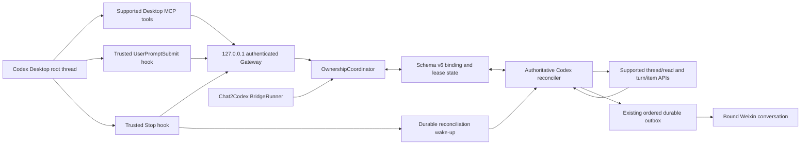
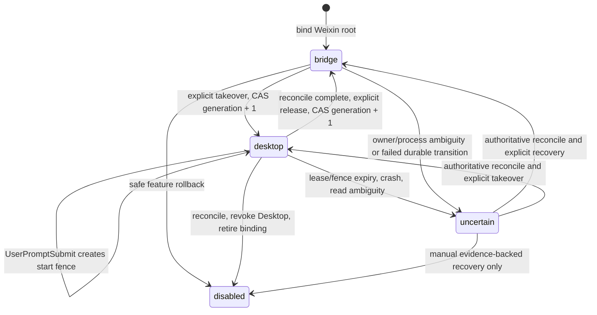

# Weixin Desktop Authenticated Loopback Gateway Fallback Design

Status: `APPROVED FOR IMPLEMENTATION PLANNING`

Direction approved: 2026-08-02

Haoda approved this specification on 2026-08-02 and authorized an implementation
plan plus the separate Phase 2/UsageAdvisor integration baseline. Gateway
implementation authorization is **not granted**. Installation/trust, `~/.codex`
changes, Desktop restart, production writes, Computer Use, and real Weixin sends
remain separate confirmation gates.

## 1. Decision and scope

Phase 3 will use a Chat2Codex-owned authenticated HTTP Gateway bound only to
`127.0.0.1`, a supported Desktop MCP surface for status and explicit ownership
commands, and trusted `UserPromptSubmit` and `Stop` hooks. The design preserves
the accepted `DESKTOP-001..003` outcomes: the exact root `threadId`, one durable
generation owner, synchronous fail-closed prompt enforcement, identifier-only
wake-up, authoritative Codex reread, exactly-once durable outbox insertion,
high-water recovery, and exclusion of unbound or child threads.

The installed AppX already runs its internal app-server. This design neither
repairs nor reinstalls AppX and does not require an external process to launch
the protected AppX binaries. It never uses development-only `plugin/list` and
does not treat an MCP dashboard or takeover button as an enforcement boundary.

### In scope

- Authenticated, redacted loopback status for the current Desktop root thread.
- Explicit bridge-to-Desktop and Desktop-to-bridge ownership transfer.
- A generation-based lease plus a start fence that prevents a prompt/start race.
- Durable binding, reconciliation cursor, idempotency, and recovery state.
- Authoritative mirroring of Desktop text and explicitly declared files into
  the existing ordered durable outbox.
- Behavior verification for all seven Phase 3 primitives.

### Out of scope

- AppX repair/reinstall or external execution of its bundled binaries.
- Any use of `plugin/list` as discovery, authentication, or enforcement.
- Autonomous Desktop takeover, lease stealing, or expiry-based writer transfer.
- Exporting arbitrary Desktop history, unbound roots, subagents, or child threads.
- Copying/importing a bridge-only thread into Desktop and calling it the same
  thread. A copied conversation never satisfies `DESKTOP-002`.
- Applying configuration, installing/trusting hooks, restarting Desktop,
  deploying to production, Computer Use, or real Weixin sends under this spec-only
  authorization.

## 2. Considered approaches

### A. Repair/reinstall AppX and externally attach to its app-server

Rejected. Read-only evidence shows the AppX internal app-server is alive, while
ordinary external processes cannot launch the protected binaries and no supported
external listener is exposed. Repair cannot supply the missing binding table,
generation lease, or cross-process writer fence.

### B. Desktop MCP dashboard with a takeover button

Rejected. It can present status but ordinary composer prompts can bypass it. It
cannot satisfy prompt-submit blocking or prove one writer.

### C. Authenticated loopback Gateway plus trusted hooks and MCP

Selected. MCP provides visible, explicit control; `UserPromptSubmit` provides the
synchronous fail-closed entrypoint; the Gateway owns durable generation CAS,
start fences, reconciliation, and outbox idempotency. This is the only current
route that preserves all accepted outcomes without depending on unsupported AppX
execution.

## 3. Trust model and invariants

The design assumes the Windows user account and Chat2Codex production directory
are the administrative trust boundary. Loopback location alone is not
authentication. Every request is authenticated and capability-scoped. A process
with administrative access to the user's token files is outside this threat model,
but token disclosure through URLs, logs, process arguments, Desktop output, or
state files is prohibited.

The following invariants are non-negotiable:

1. A concrete root `threadId` has at most one current owner: `bridge`, `desktop`,
   `uncertain`, or `disabled`.
2. Every successful ownership transfer increments a positive, monotonic
   `generation`. Generations are never reused or decremented.
3. Lease expiry, heartbeat loss, Gateway restart, or incomplete reconciliation
   yields `uncertain`; none grants ownership to another writer.
4. A bridge turn and a Desktop prompt both validate owner plus generation before
   starting work. A Desktop prompt additionally creates a durable start fence.
5. A start fence or unreconciled Desktop turn prevents bridge takeover. Timeout
   changes it to `uncertain`, never to free ownership.
6. Hook output is never authoritative result content. `Stop` only wakes a
   reconciler; supported Codex read APIs supply text, turn state, and declared
   outputs.
7. High-water state advances in the same transaction that inserts all newly
   eligible outbox records.
8. Only an explicitly bound concrete root `threadId` may export to its bound
   conversation. Root `session_id` alone never authorizes child export.
9. Authentication failure, missing binding, stale generation, state-save failure,
   Gateway timeout, unknown owner, or read ambiguity fails closed.
10. A binding is created only after both bridge and Desktop can read the same
    concrete root from the same supported Codex persistence.

### 3.1 Shared Codex persistence precondition

Current production explicitly sets `CODEX_HOME=F:\Chat2Codex\codex-home`; the
Desktop app normally uses the user's Codex home. Shared persistence is therefore
a high-risk precondition, not an assumption. Before schema migration or binding,
a disposable proof must demonstrate that a newly created bridge root appears in
Desktop and that both sides read the same concrete `threadId` and authoritative
turn digest through supported APIs after restart. No database file is copied,
merged, or rewritten to manufacture this result.

If the two products cannot safely use the same supported persistence root, Phase 3
stops at design review. Existing threads under the isolated production Codex home
remain bridge-only and unbound. Moving or changing `CODEX_HOME`, importing existing
history, or changing the production launcher is a separate production/configuration
action requiring explicit approval and a hash-verified migration/rollback rehearsal.

## 4. Architecture



### 4.1 Loopback Gateway

The HTTP server binds explicitly to IPv4 `127.0.0.1`; it does not bind `0.0.0.0`,
LAN addresses, IPv6, or a browser-facing origin. It exposes no unauthenticated
health, metrics, status, or CORS endpoint. Request bodies and responses are
strictly schema-validated and bounded. Logs contain request ID, caller role,
endpoint class, decision code, and latency only; they never contain tokens, HMACs,
prompt text, sender identity, file paths, or result content.

The Gateway is a thin authenticated transport over `OwnershipCoordinator` and
the reconciler. It runs inside the one production Chat2Codex writer process and
delegates every mutation through the existing serialized state transaction; an
HTTP handler never writes a sidecar or state file directly. The bridge calls the
same coordinator in-process so Desktop and bridge cannot acquire ownership under
different rule sets. If that process is down, hooks block and no second Gateway
writer starts.

The minimal surface is versioned and closed: authenticated `status`,
`desktop-heartbeat`, `takeover-desktop`, `release-bridge`,
`user-prompt-submit`, and `stop-wake`. All parameters use bounded request bodies,
not query strings. Unknown routes and methods fail closed. The server validates
the loopback peer, expected `Host`, and content type; disables CORS and redirects;
and applies short request deadlines and bounded concurrent connections.

### 4.2 Supported Desktop MCP surface

The MCP surface provides only:

- redacted status for the current concrete root `threadId`;
- explicit `take_over_for_desktop(expectedGeneration)`;
- explicit `release_to_bridge(expectedGeneration)`; and
- bounded recovery guidance when state is blocked or uncertain.

Status may show a sanitized task label, shortened task/conversation identity,
current owner, generation, lifecycle state, last reconciliation time, and whether
an outbox obligation exists. It does not return prompts, chat/sender IDs, absolute
paths, credentials, hook keys, raw output, or approval values. MCP discovery or
status never grants ownership.

Takeover and release controls must not depend on an unsafe model turn. The
preferred route is a supported MCP/app UI action that calls the relevant endpoint
independently of a Codex turn. If the installed Desktop cannot invoke such an
action outside a turn, the only acceptable fallback is an exact, reserved local
control prompt intercepted by `UserPromptSubmit`: the hook authenticates and
performs the takeover CAS, or atomically records a bounded `releaseRequested` flag,
and still returns `decision: block` so that control prompt never reaches the model.
Release reconciliation then runs asynchronously and performs the release CAS only
after all obligations are complete. The user submits an actual task only after
status shows the new generation/owner. Free-form intent parsing, an MCP tool invoked
by a model turn under the old owner, releasing while a Desktop turn/fence is active,
or allowing a control prompt to start Codex are prohibited. Which route exists is
an installed behavior gate, not an assumption.

Because Codex allocates `turn_id` before `UserPromptSubmit`, the design does not
assume a blocked control turn is absent from persisted history. The control
mutation records that exact `turn_id`, control kind, origin generation, and the
code-owned prompt commitment in a bounded `excludedControlTurns` map. During
authoritative reconciliation, a matching persisted control turn is validated and
advanced as non-exportable with zero outbox parts; an absent control turn is also
safe and the exclusion remains bounded until retention. A different prompt,
assistant output, tool item, or digest at that turn ID is an integrity conflict.
Control-turn exclusion never applies to an ordinary prompt fence.

### 4.3 Trusted hooks

`UserPromptSubmit` is the enforcement point for an ordinary Desktop root prompt.
Official hook input includes the raw `prompt`, parent/root `session_id`, and the
already allocated active `turn_id`. The hook computes the prompt digest locally
and sends no raw prompt. It sends `session_id`, the actual `turn_id`, a SHA-256
prompt digest, hook request ID, and timestamp. The Gateway permits only a bound
root whose concrete `threadId` is proven to equal that root `session_id`, whose
owner is `desktop`, whose generation and lease are current, and which has neither
another active turn nor an unresolved fence. The permit transaction creates the
start fence bound directly to this hook-provided `turn_id` before returning success;
later reconciliation never guesses which turn matches a fence.

If the Gateway cannot prove every condition, the hook returns the supported block
decision or exits with code 2 and one concise remediation message. The hook uses
a short internal HTTP deadline and catches every handled network, authentication,
schema, signature, and local I/O error so Gateway unavailability actively produces
that block before the longer Codex command-hook deadline.

Official documentation says a command-hook timeout/error is reported as hook
failure; it does not promise that such a failure blocks `UserPromptSubmit`. Missing
executable, process crash, outer timeout, untrusted/changed hash, disabled hooks,
and conflicting hook configuration are therefore explicit installed behavior
gates rather than assumed fail-closed cases. Before any root is bound,
`hooks/list` must prove the exact trusted definition is active. Behavior tests must
show that all six failure modes block or otherwise make prompt submission impossible.
If any mode silently continues, the fallback is not implementable as specified;
no binding or same-thread claim is allowed. A periodic heartbeat or MCP status
cannot close the race created by a skipped hook.

Official command-hook input for `Stop` contains the parent/root `session_id` and
active `turn_id`, not a separate concrete `threadId`. The root Stop handler sends
only event ID, `session_id`, `turn_id`, and observed timestamp. The Gateway accepts
it only when `session_id` exactly matches an explicit root binding and the turn can
later be found in that root by authoritative read. `SubagentStop` is not registered
as an export wake-up and cannot use the root binding. Any hook text,
`last_assistant_message`, claimed result, or file list is ignored. Loss or
duplication of `Stop` is safe because restart and periodic recovery reconcile from
authoritative state.

Unlike `UserPromptSubmit`, `Stop` is advisory: official `decision: block` or exit
code 2 asks Codex to continue the turn. The Stop hook therefore never emits either
form. After a bounded best-effort wake attempt it exits 0 with no continuation
decision, including when the Gateway is unavailable; recovery scanning remains
the correctness path. A Stop hook failure may be diagnosed but must not create a
continuation prompt or become result content.

### 4.4 Authoritative reconciler

For each bound Desktop-owned or uncertain root, the reconciler reads the thread
through supported Codex app-server APIs compatible with the pinned protocol. The
normative read is stable `thread/read` with `includeTurns: true`; it must validate
the concrete root `threadId`, complete ordered turns, terminal state, and item
shape before accepting content. Experimental `thread/turns/list` and
`thread/items/list` may be used only as a version-pinned optimization after
equivalence with `thread/read` is proven; they are never the only recovery path.
Desktop UI text, hook payloads, transcript files, SQLite/log scraping, and
experimental WebSocket transport are not authoritative sources.

The reconciler begins after the binding anchor and advances in authoritative turn
order. It extracts final text and the existing explicit output declaration only.
Declared files pass the Phase 2 ownership, root, quota, symlink, sniffing, staging,
and hashing gates before insertion into the ordered outbox. A read/schema/version
error leaves the fence and high-water mark unchanged and moves ownership to
`uncertain`.

## 5. Strong authentication protocol

### 5.1 Keys and capabilities

Provision independent 256-bit random keys for `prompt_hook`, `stop_hook`, and
`desktop_mcp`. Each key has an immutable endpoint allowlist. The prompt key cannot
call general MCP takeover/release endpoints; inside `user-prompt-submit` it may
perform only an exact reserved takeover or release-request operation whose keyed
prompt commitment matches the code-owned literal. The Stop key can only enqueue a
wake; the MCP key cannot submit hook decisions. Keys live in separate owner-only token files outside the
durable bridge state and are never placed in command-line arguments, URLs, MCP
tool results, logs, or source control. Windows ACL and fresh-process behavior must
be verified before trust.

Creating token files or referencing them from `~/.codex` is an installation action
and remains separately confirmed.

Both sides validate token files, not only the Hook/MCP client. Before the Gateway
listens, it opens each configured absolute file without following symlinks, requires
a regular file, verifies owner-only Windows ACLs and no inherited broad read ACE,
reads exactly one bounded base64url secret, and rejects duplicate key material or
paths. It retains decoded key bytes in memory only and zeroes temporary buffers
where the runtime permits. Any validation failure prevents Gateway readiness and
therefore keeps prompt submission blocked. The same checks run in a fresh process
after rotation; a prior successful process is not evidence for current ACL/content.

### 5.2 Signed request

Every request carries protocol version, key ID, caller role, UUID request ID, UTC
timestamp, 128-bit random nonce, body SHA-256, and HMAC-SHA-256 over the canonical
method, path, metadata, and body digest. Canonicalization uses uppercase method,
the exact normalized path, fixed field order, UTF-8 bytes, explicit byte lengths,
and the exact received body bytes; duplicate headers/fields and alternate path
encodings are rejected. Comparison is constant-time. The secret itself is never
transmitted.

Prompt content uses a domain-separated HMAC-SHA-256 commitment under the scoped
prompt key, not a plain SHA-256 digest that could disclose low-entropy prompts by
dictionary attack. The Gateway recomputes commitments for the two code-owned
control literals before authorizing their narrow mutations. Ordinary prompt
commitments are used only to bind the authenticated request/fence and are never
logged or returned by status.

Every response is also authenticated with the caller's scoped key and binds the
protocol version, request ID, request nonce, decision code, generation, optional
fence ID, response body digest, and server timestamp. The hook/MCP client verifies
that MAC, freshness, and exact request binding before honoring a permit or status.
A process that binds the port while the real Gateway is absent cannot manufacture
a valid allow response. An unsigned, stale, mismatched, redirected, or malformed
response is a block.

The Gateway rejects unknown key IDs/roles, wrong endpoint scope, invalid MAC, body
digest mismatch, timestamps outside a 30-second window, reused nonce, oversized
body, or duplicate mutation request with different bytes. A bounded in-memory
nonce cache covers the freshness window. Durable mutation request IDs and event
IDs make takeover, release, start-fence creation, and Stop wake-up idempotent
across Gateway restarts. Read-only status replay has no state effect.

Authentication errors return one generic denial and do not reveal whether a
thread or task exists. Clock skew, token rotation, and protocol mismatch have
distinct local diagnostic codes but no secret-bearing response.

### 5.3 Rotation and compromise

Rotation creates new scoped keys, atomically changes the accepted key IDs, and
revokes old IDs after a bounded overlap. A suspected leak immediately blocks new
Desktop starts, marks affected Desktop leases `uncertain`, rotates all relevant
keys, and requires authoritative reconciliation before another owner is granted.

## 6. Durable state and ownership state machine

Phase 3 requires schema v6. It is an additive successor to the full current
schema v5 and must preserve Phase 2 media/outbox and UsageAdvisor partitions and
invariants. A separate sidecar was rejected because ownership,
high-water advancement, and outbox insertion must be one atomic state transaction.
Older schema-v5 binaries therefore fail closed instead of silently dropping an
active lease.

The conceptual binding record is:

```json
{
  "bindingId": "opaque UUID",
  "rootThreadId": "Codex UUID",
  "taskId": "Chat2Codex task ID",
  "conversationId": "bound conversation ID",
  "adapterId": "weixin adapter partition",
  "owner": "bridge | desktop | uncertain | disabled",
  "generation": 12,
  "ownerInstanceId": "ephemeral process identity",
  "leaseExpiresAt": "UTC timestamp",
  "bindingAnchorTurnId": "last turn that predates export eligibility",
  "lastReconciledTurnId": "opaque turn ID or null",
  "lastMirroredTurnId": "opaque turn ID or null",
  "lastAuthoritativeDigest": "SHA-256 or null",
  "activeStartFence": {
    "turnId": "actual UserPromptSubmit turn_id",
    "originGeneration": 12,
    "requestId": "authenticated UUID",
    "promptCommitment": "domain-separated HMAC-SHA-256",
    "issuedAt": "UTC timestamp"
  },
  "excludedControlTurns": {
    "turn-control-1": {
      "kind": "takeover | release_request",
      "originGeneration": 12,
      "promptCommitment": "domain-separated HMAC-SHA-256",
      "recordedAt": "UTC timestamp"
    }
  },
  "pendingWakeIds": [],
  "createdAt": "UTC timestamp",
  "updatedAt": "UTC timestamp"
}
```

`ownerInstanceId` and expiry detect liveness but do not authorize takeover.
Authentication keys are not part of this record. Pending wake IDs and durable
mutation IDs are bounded. Raw prompt, result text, file path, sender, approval,
and credential data are forbidden.

### 6.1 Ownership transitions



Takeover is a compare-and-swap over binding ID, expected owner, expected generation,
no active/pending bridge turn, no start fence, and a completed reconciliation
cursor. The successful transaction increments generation and changes owner. The
bridge's pre-turn gate uses the same expected generation.

`UserPromptSubmit` permit is also a state mutation. It stores a one-time fence
containing the hook's actual `turn_id`, origin generation, request ID, prompt
commitment, and issued time. While the fence exists, bridge takeover and bridge turn
start fail. Hook retry with the same authenticated request is idempotent; a
different body for the same request ID is rejected. If authoritative read does not
find exactly that fenced turn under the bound root, or finds a digest/order
conflict, the binding becomes `uncertain`; elapsed time never clears it
automatically.

Desktop release first reconciles the fenced/completed turn, atomically inserts any
new outbox entries and advances high water, then increments generation and returns
owner to `bridge`. Bridge takeover cannot precede that sequence.

## 7. High-water recovery and idempotent outbox

At binding time, `bindingAnchorTurnId` records the last authoritative root turn.
Nothing at or before the anchor is exportable. For each later terminal root turn,
the reconciler derives a canonical result digest and ordered delivery parts.
Turn IDs are opaque and are never compared lexically or numerically. High water
advances only by the order returned in a complete stable
`thread/read(includeTurns: true)` snapshot after verifying that the prior anchor/
high-water turn and its saved digest still exist at the expected position. A
missing/reordered prior turn or an incomplete/oversized response is an integrity
conflict; no outbox or cursor change is committed. Experimental pagination may
optimize reads only after the same ordering/digest invariants are proven.
An exact excluded control turn may advance reconciliation high water with no
outbox entry only after its code-owned commitment and no-model-output shape are
validated. It can never satisfy, replace, or clear an ordinary start fence.

Each outbox identity is deterministic. `generation` is the origin generation
recorded on the matching start fence, not whichever generation happens to be
current during later recovery:

```text
desktop:<bindingId>:<generation>:<turnId>:<partIndex>:<sha256>
```

Reinsertion with the same identity and bytes is a no-op. The same logical position
with different bytes is an integrity conflict: no high-water advancement, no
delivery, and owner becomes `uncertain`. The transaction inserts every text/media
part, records the authoritative digest, clears the matched start fence/wake, and
advances `lastReconciledTurnId` and `lastMirroredTurnId` together. A crash commits
all or none. Existing outbox retry and stable Weixin client ID behavior provides
delivery idempotency without rerunning Codex.

On Gateway/bridge startup, reconciliation scans every binding with owner
`desktop` or `uncertain`, every active fence, and every pending wake. It rereads
from the binding anchor/high water, not from the notification. A missed Stop,
duplicate Stop, crash after Desktop completion, crash before outbox insertion,
and crash after insertion all converge to the same durable state. An unavailable
Codex read API retains obligations and blocks owner transfer.

## 8. Root and child/subagent identity

For a resumed root, official Codex source establishes `session_id == rootThreadId`.
A child/subagent has a distinct concrete `threadId` while retaining the root
`session_id`. Consequently:

- bindings are keyed only by the concrete root `threadId`;
- `session_id` may locate a candidate root for ordinary root prompt enforcement,
  but never authorizes export by itself;
- any event that exposes a concrete `threadId` must equal the bound root;
- a child concrete `threadId`, even with the bound root `session_id`, is unbound,
  non-exportable, and cannot acquire the root generation;
- child output, declared files, Stop events, and wake-ups never enter the root
  outbox; and
- if the installed hook payload cannot distinguish the root prompt from a child
  context as required, the prompt blocks and the primitive fails acceptance. The
  published `UserPromptSubmit` shape has no child `agent_id`; installed behavior
  must prove whether subagent flows emit this event and that they cannot inherit a
  root permit.

There is no automatic child binding. A future concrete-child export feature would
require a separate accepted change and a new explicit binding.

## 9. Failure behavior

| Condition | Required behavior |
| --- | --- |
| Gateway down, internal deadline, or protocol mismatch | The hook actively returns block/exit 2; no Desktop turn is accepted |
| Hook missing, crashed, outer-timed-out, untrusted, disabled, or conflicting | Installation gate must behavior-prove prompt cannot continue; otherwise no binding is permitted |
| Missing/disabled binding | Block with redacted recovery guidance |
| Stale generation or wrong owner | Block; never refresh or transfer implicitly |
| Lease or start-fence expiry | Mark `uncertain`; reconcile; do not grant a writer |
| State save/CAS failure | Deny operation and preserve previous durable owner |
| Duplicate signed request or Stop event | Return/replay the same idempotent outcome; no duplicate wake/outbox |
| `thread/read` unavailable or malformed | Retain fence/high water/outbox obligations; mark `uncertain` |
| Authoritative content differs for an existing outbox identity | Quarantine as integrity conflict; do not deliver or advance |
| Token authentication failure | Generic denial, no existence leak, no state mutation |
| Child or unbound thread event | Ignore for export, record bounded redacted diagnostic |
| Blocked control turn is absent from history | Keep its bounded exclusion record until retention; do not create outbox or block ordinary high-water recovery |
| Control turn contains non-control prompt or model/tool output | Integrity conflict; mark uncertain and do not advance or deliver |
| Gateway crash during ownership transfer | Atomic CAS yields old or new generation; restart reconciles before new work |

## 10. Seven-primitive behavior acceptance matrix

Static schemas, source inspection, unit tests, and a status screenshot are not
sufficient. Every row needs installed behavior evidence on a disposable bound
root, followed by the named real Desktop/Weixin evidence where specified.

| Primitive | Behavior test | Pass condition | Required evidence |
| --- | --- | --- | --- |
| 1. Desktop status/MCP surface | First prove shared supported persistence for a disposable root; open the bound root, query status, restart Gateway, query again; use wrong key and unavailable Gateway | Both sides read the identical concrete root before binding; supported MCP loads without `plugin/list`; state is authenticated/redacted/current after reconnect; auth failures reveal no binding data | Shared-persistence/thread digest transcript, timestamped Desktop capture, authenticated decision logs without secrets, before/after state hash, reconnect transcript |
| 2. `UserPromptSubmit` lease enforcement | Submit under bridge owner, current Desktop owner, stale generation, missing binding, `uncertain`, bad auth, Gateway down, missing/crashed/timed-out/untrusted/disabled hook, and child context; exercise the supported takeover bootstrap | Only current Desktop owner can create one durable fence bound to the hook's actual `turn_id`; every negative case blocks; takeover starts no model turn under the old owner | Hook exit/decision records, generation/fence snapshots, exact `turn_id`, Desktop blocked-state capture, `hooks/list` trust state, zero unexpected turns |
| 3. Same-thread takeover | Create via Weixin/bridge, transfer bridge→Desktop→bridge, run one turn under each owner | Every turn uses the exact original root `threadId`; generations increase; no cloned/copied thread; no overlapping start | Thread/read transcript, thread IDs, CAS log, process/turn timeline, state hashes |
| 4. Stop/completion wake-up | Complete a Desktop root turn with one Stop, duplicate Stop, missing Stop, and crash before wake handling; inject false hook content and a `SubagentStop` | Root Stop carries only `session_id`/`turn_id` wake metadata; duplicates are harmless; missing wake is recovered; injected and subagent content is ignored | Redacted hook envelopes, durable wake IDs, restart/reconcile logs, proof hook/child text never becomes outbox text |
| 5. Authoritative `thread/read` | Complete bound text plus declared file, then reread using supported APIs; make read unavailable/malformed | Mirrored bytes and hashes match authoritative read/staged file; failure advances neither fence nor high water | Protocol transcript/version, content/file SHA-256, ordered outbox snapshot, negative read log |
| 6. Single-writer competition | Race bridge start, Desktop prompt, takeover/release, stale request, expired lease, and crash at each CAS/fence boundary | Exactly one owner/generation/start wins; stale or uncertain participants fail closed; no second turn starts | Deterministic race tests, installed timing trace, generation history, zero concurrent turns for root |
| 7. Unbound/child exclusion | Complete an ordinary unbound Desktop root and a child/subagent sharing the bound root `session_id`; restart reconciliation | Neither concrete unbound/child `threadId` creates wake/outbox/export; root binding remains unchanged | Root/child identity transcript, outbox before/after hash, zero delivery IDs, redacted exclusion diagnostic |

The matrix must additionally prove no real Weixin delivery occurs before the
separate external-send confirmation. Automated adapter fakes may verify ordering
and idempotency before that gate.

## 11. Test and evidence plan

Before installation, automated verification covers:

- HMAC canonicalization, scoped keys, constant-time validation, freshness, replay,
  rotation, body bounds, and redacted logs;
- binding/state coercion, schema-v5-to-v6 migration on copies, future-schema
  refusal, exact v6 backup hash, and rollback transform;
- a disposable shared-Codex-home compatibility rehearsal that proves identical
  `threadId`/turn digests and leaves existing isolated production roots untouched;
- every legal and illegal ownership transition, stale generation, start fence,
  excluded control turn present/absent/conflicting, expiry-to-uncertain, and crash point;
- hook permit/block response construction with no prompt persistence;
- Stop idempotency, missed wake, authoritative pagination/read errors, high-water
  invariants, outbox identity conflicts, restart convergence, and no Codex rerun;
- root/child identity negatives and absence of raw prompt/sender/path/credential
  data from Gateway state/logs; and
- full typecheck, contracts, deterministic test shards, build, audit, package,
  state-copy migration/rollback, and zero residual process identities.

Installed evidence must record exact package/app/Codex versions and hashes, hook
hash/trust state, MCP status, Gateway bind address/process identity, scoped-key
file ACL results, protocol transcripts with secrets removed, state/outbox hashes,
screenshots/timestamps, and the seven-row results. A killed or timed-out run is
negative evidence and never counts as passing.

Real acceptance then separately confirms the intended test direct chat, fresh
Desktop/Weixin handles, same root thread, text then image/file ordering, retry,
restart, deduplication, and no Codex rerun. Computer Use initialization and the
final Weixin send each require action-time confirmation.

## 12. Rollback

### 12.1 Immediate safe feature rollback

1. Enter maintenance mode and block new bridge/Desktop turn starts.
2. Authoritatively reconcile every binding, fence, wake, and outbox obligation.
3. Resolve all `uncertain` bindings manually; do not infer completion from time.
4. CAS each safe binding to `bridge` with generation + 1 and disable Desktop
   takeover.
5. Rotate/revoke Desktop MCP and Stop keys. Keep the trusted prompt hook in
   fail-closed bridge-only mode so bound roots cannot be edited concurrently.
6. Verify one bridge writer, no Desktop fence/turn, and stable outbox/high-water
   hashes before accepting bridge work.

This removes Phase 3 functionality without downgrading state and is the preferred
operational rollback. It still requires production-write and hook/config
confirmations when executed.

### 12.2 Full uninstall or package downgrade

1. Complete immediate rollback and archive a hash-verified schema-v6 backup.
2. Retire every formerly shared root binding from bridge execution or move the
   task to a fresh bridge-only thread; same-thread handoff is explicitly withdrawn.
3. Prove no active fence, Desktop turn, pending wake, unreconciled turn, or
   non-delivered outbox obligation remains.
4. On a copy, transform v6 to v5 by removing only fully reconciled Gateway
   records; preserve every v5 adapter partition and field byte-equivalently after
   canonical serialization, including tasks, conversations, chats, jobs, pending
   messages, diagnostics, image drafts, clarifications, UsageAdvisor, and all
   text/media outbox entries and staged-file hashes. Verify their counts, owners,
   references, ordering, and hashes. An old v5 binary must fail closed on
   untransformed v6.
5. With separate confirmation, uninstall/disable MCP and hooks, revoke/delete
   scoped keys, stop Gateway, restore the verified v5 copy, and start the old
   package as one bridge writer.
6. Run old-version load/smoke and confirm the system no longer claims
   `DESKTOP-001..003`.

If any binding cannot be reconciled, full uninstall/downgrade stops. The v6
backup and fail-closed hook remain; data is not discarded to force rollback.

## 13. Delivery estimate and change

The earlier fallback estimate was 2–2.5 engineering days plus Desktop/Weixin E2E.
The current design increases implementation and automated verification to
**3–3.5 engineering days** because strong scoped HMAC authentication, persistent
anti-replay/idempotency, a durable start fence, schema-v6 migration/rollback,
crash-safe high-water reconciliation, and child-thread negative coverage are now
explicit gates.

After code passes automated gates, installed Hook/MCP/Gateway setup and the seven
Desktop behaviors require **0.5–1 engineering day**, and separately confirmed
real Weixin plus rollback drills require about **0.5 engineering day**. Total is
therefore **4–5 engineering days**, excluding approval wait, unavailable Codex
behavior, or external product defects. The obsolete 1–3 hour AppX repair path is
removed from the critical path; no repair/reinstall time is planned.

If installed `UserPromptSubmit` cannot behavior-block every required negative case
or cannot distinguish the root context sufficiently to prevent child inheritance,
the design is not implementable as specified. Work returns to requirements/design
review immediately; it does not degrade to dashboard-only mirroring.

## 14. Review and authorization gates

Haoda approved this design and authorized writing an implementation plan and
building the Phase 2/UsageAdvisor integration baseline. Until Haoda separately
approves that implementation plan:

- no Gateway, state schema, hook, MCP, or reconciler code may be implemented;
- no `~/.codex` file, Hook trust record, Desktop process, AppX package, production
  state, or Weixin conversation may be changed; and
- the overall Goal remains active with all seven Phase 3 primitives behavior-
  unverified.
